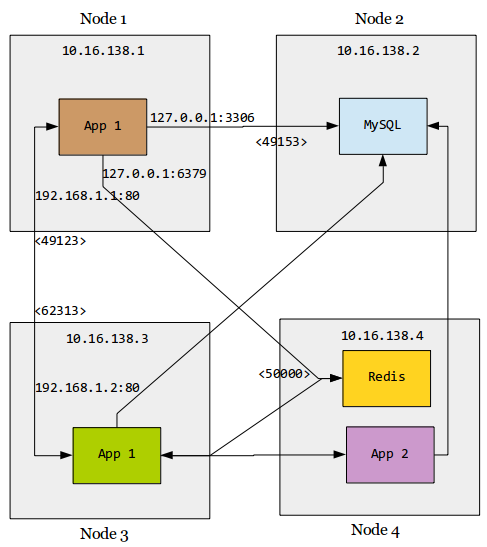

## iptables-based container network linking

### Gear linking

There are several approaches to link linux containers using linux bridges, openvswitch, GRE tunnels, etc. Geard uses iptables to simplify linking containers and should satisfy majority of the cases where one would want to connect containers. Consider the image above where we have the application running on node 1 and redis running on node 4. Gear network linking can be used to link the redis container to the application container as follows: 

Install and start the redis container on node 4:

    
    $ gear install -p 6379:50000 --isolate mrunalp/fedora-redis node4:43237/redisdb --start
    

Install a sample application that uses redis on node 1:

    $ gear install --isolate mrunalp/redis-todo node1:43273/app1
    
Link the redis container to the application container on node1 and start it:
    
    $ gear link -n "6379:10.16.138.4:50000" node1:43273/app1
    $ gear start node1:43273/app1 
    
Now, the application is able to use redis as if it were running locally at 127.0.0.1:6379.
The IP Address could also be explicity specified as below:

    $ gear link -n "127.0.0.1:6379:10.16.138.4:50000" node1:43273/app1

The same idea can be extended to setup an application cluster like in the image above where the application has two containers. It is then linked to mysql running on node 2 and redis on node 4. The application is also linked to another application running to node 4, which in turn is connected to mysql. 

Database cluster configuration could be simplified by having each container in the cluster have the same view of
the network topology of the cluster. For e.g. a 3-node mongo cluster could be configured by linking the containers to each other on the 192.168.1.* IP Addresses.

### Gear deploy

Geard helps simplify the complex linking scenarios as described in the previous section by allowing one to write deployment descriptors in json. The redis example that we setup in the previous section could be setup easily by
gear deploy by using the descriptor here [https://github.com/openshift/geard/blob/master/deployment/fixtures/redis_martini_deploy.json]

    $ gear deploy redis_martini_deploy.json localhost:43273
    
There are several other deployment descriptors here - [https://github.com/openshift/geard/tree/master/deployment/fixtures]

    
### Under the hood

We enable localnet routing and ip forwarding in the network namespace of the container.

    /usr/sbin/sysctl -w net.ipv4.ip_forward=1
    /usr/sbin/sysctl -w net.ipv4.conf.all.route_localnet=1
    
iptables NAT rules are added to forward the traffic to the remote endpoint.

    iptables -t nat -A PREROUTING -d ${local_ip}/32 -p tcp -m tcp --dport ${local_port} -j DNAT --to-destination ${remote_ip}:${remote_port}

    iptables -t nat -A OUTPUT -d ${local_ip}/32 -p tcp -m tcp --dport ${local_port} -j DNAT --to-destination ${remote_ip}:${remote_port}

    iptables -t nat -A POSTROUTING -o eth0 -j SNAT --to-source ${container_ip}
    

Geard stores the local and remote endpoints when gear link command is run. The rules are then applied when
the container is started using the gear start command.
